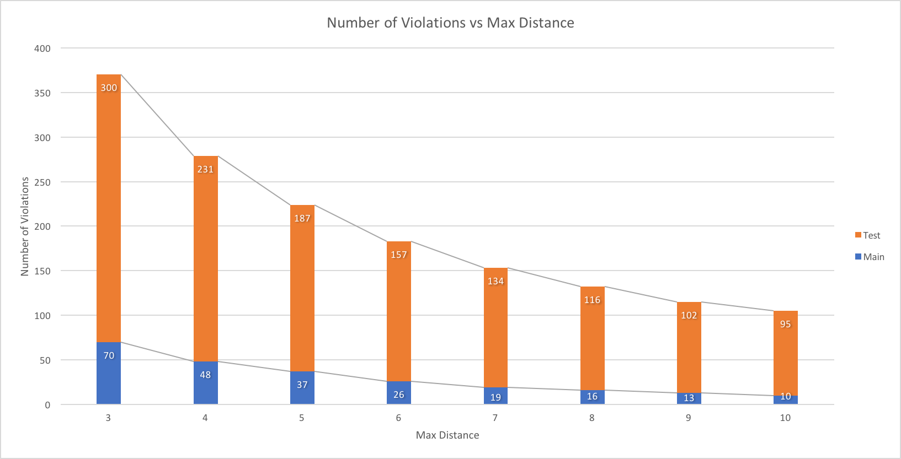
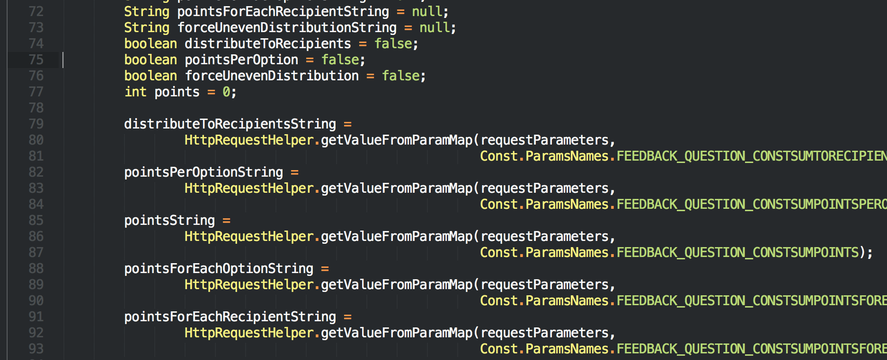
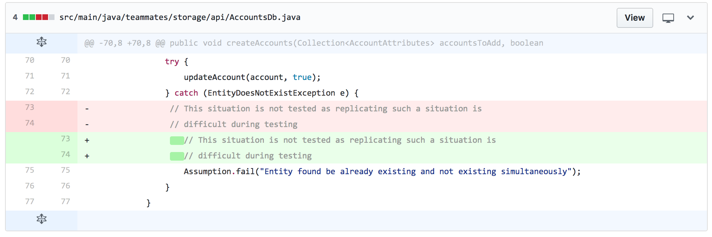
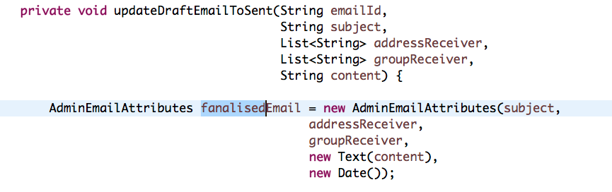
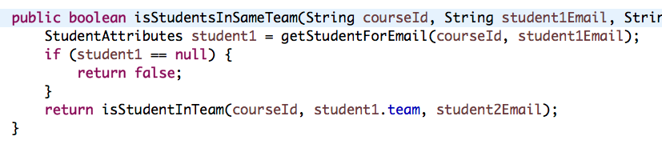
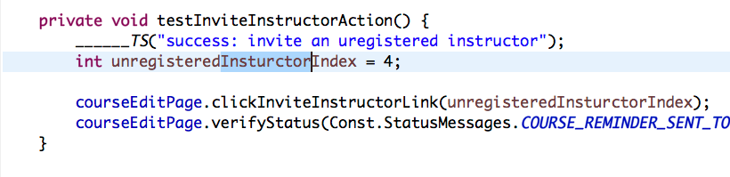
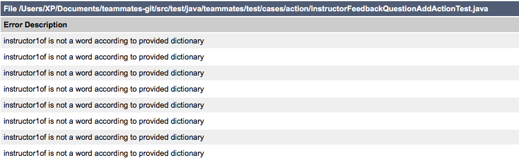
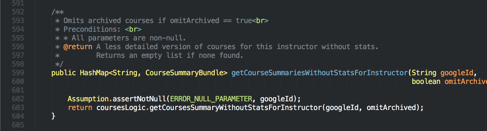

## Additional Static Analysis Rules for Teammates (Java)

### Introduction

#### Background

Currently, five(six) static analysis tools are used in TEAMMATES.

Here are the configuration of them.

- [checkstyle](https://github.com/TEAMMATES/teammates/blob/bd97f4210749b8a58a8285258098c2f91d492099/static-analysis/teammates-checkstyle.xml)
- [eslint](https://github.com/TEAMMATES/teammates/blob/bd97f4210749b8a58a8285258098c2f91d492099/static-analysis/teammates-eslint.yml)
- [macker](https://github.com/TEAMMATES/teammates/blob/bd97f4210749b8a58a8285258098c2f91d492099/static-analysis/teammates-macker.xml)
- [pmd](https://github.com/TEAMMATES/teammates/blob/bd97f4210749b8a58a8285258098c2f91d492099/static-analysis/teammates-pmd.xml) (As we decide some of rules in PMD will only be enforced in production, we write another [configuration](https://github.com/TEAMMATES/teammates/blob/bd97f4210749b8a58a8285258098c2f91d492099/static-analysis/teammates-pmdMain.xml) in addition to this)
- [stylint](https://github.com/TEAMMATES/teammates/blob/bd97f4210749b8a58a8285258098c2f91d492099/static-analysis/teammates-stylelint.yml)
- [findbugs](https://github.com/TEAMMATES/teammates/blob/bd97f4210749b8a58a8285258098c2f91d492099/build.gradle#L326) (Only one pattern `FindDeadLocalStores` is used)

*Updated at commit [bd97f42](https://github.com/TEAMMATES/teammates/commit/bd97f4210749b8a58a8285258098c2f91d492099) at master* 

In discussion in [#6519](https://github.com/TEAMMATES/teammates/issues/6519), we agree that we use checkstyle for **style** issues and PMD for **coding/design** issues. The rest of the report will follow the rule also.

`macker` is used to detect violation in high-level design principle. For example, one of the current enforced rule says "Test cases should not be dependent on each other". Currently, there are only two rules for this analyser. More rules should be added to reflect the [design](https://github.com/TEAMMATES/teammates/blob/90b40c0e18c5856424178b0fb99964c4a3cdb2da/docs/design.md).

`findbugs` cannot print violations in build log. We cannot check wether the build is successful or not in CI environment. Therefore, we exclude it and only put one rule for it.

### Discussion

This report will discuss the static analysis tools for java, which are `checkstyle`, `macker`, `pmd`, `findbugs`. Rules or customised checks will be from these tools.

We can divide the possible static analysis rules into three part. `Coding Standard`, `Design Principle` and `Bug Prevention`. 

#### Coding Standard

We use coding standard in [OSS Generic](https://oss-generic.github.io/process/codingStandards/CodingStandard-Java.html) project for TEAMMATES. Most of the standards have been enforced through the checkStyle configuration. Severals of them can be explored more.

##### Boolean Variable Naming Conversion

In the coding standard, it says that "boolean variables should be prefixed with ‘is’". There are a few alternatives, which are "has", "can", "should". Also it required to avoid boolean variables that represent the negation of a thing (`isNotInitialized` is better than `isInitialized `).

Currently, all the static analysis tools don't support this standard. We shall write our own check.

CheckStyle provided a way to write customised check. [Here](https://github.com/xpdavid/teammates/blob/checkstyle-boolean-variable/static-analysis/checkstyle-lib/src/java/BooleanNameCheck.java) is what the checks look like for this particular boolean naming rule.

``` java
// Part of code (Core Logic)

for (String allowedPrefix : allowedPrefixes) {
    if (variableName.startsWith(allowedPrefix)) {
        if (isNameNegationOfThing(variableName, allowedPrefix)) {
            log(ast.getLineNo(), ast.getColumnNo(),
                    String.format(MSG_NEGATION, variableName), ast.getText()); // violation caught
        }
        return;
    }
}

log(ast.getLineNo(), ast.getColumnNo(),
        String.format(MSG_NAMING, Arrays.toString(allowedPrefixes)), ast.getText()); // violation caught
```
When run the code against TEAMMATES ([bd97f42](https://github.com/TEAMMATES/teammates/commit/bd97f4210749b8a58a8285258098c2f91d492099 at master)), here are reports for `checkstyleMain` and `checkstyleTest`

- [CheckstyleMain](http://htmlpreview.github.io/?https://github.com/xpdavid/CS2103R-Report/blob/master/codingStandard/booleanNaming/main.html)
- [CheckstyleTest](http://htmlpreview.github.io/?https://github.com/xpdavid/CS2103R-Report/blob/master/codingStandard/booleanNaming/test.html)

For production code, there are 122 violations. Some of them may be reasonable as its name may start with `allow` instead of `is, has, can, should`. For the negation of naming, there are some false positive such as `isNotSureAllowed` and `isNotificationIconShown`.

##### Variable Declaration Usage Distance

In the coding standard, it says "variables should be initialised where they are declared and they should be declared in the smallest scope possible". There is a rule existing in checkstyle for this `VariableDeclarationUsageDistance`, which just checks the distance between declaration of variable and its first usage.

The default distance of this check is `3`. Here is the graph of number of violations VS `distance`. (*Based on [8f873](https://github.com/TEAMMATES/teammates/tree/8f87384b01cbe910d805d33bd19f77636c85d06d) at master*)



Individual reports:

- checkstyleMain: [Max Distance 3](http://htmlpreview.github.io/?https://github.com/xpdavid/CS2103R-Report/blob/master/codingStandard/variableDistance/checkstyle_3/main.html), [Max Distance 4](http://htmlpreview.github.io/?https://github.com/xpdavid/CS2103R-Report/blob/master/codingStandard/variableDistance/checkstyle_4/main.html), [Max Distance 5](http://htmlpreview.github.io/?https://github.com/xpdavid/CS2103R-Report/blob/master/codingStandard/variableDistance/checkstyle_5/main.html), [Max Distance 6](http://htmlpreview.github.io/?https://github.com/xpdavid/CS2103R-Report/blob/master/codingStandard/variableDistance/checkstyle_6/main.html), [Max Distance 7](http://htmlpreview.github.io/?https://github.com/xpdavid/CS2103R-Report/blob/master/codingStandard/variableDistance/checkstyle_7/main.html), [Max Distance 8](http://htmlpreview.github.io/?https://github.com/xpdavid/CS2103R-Report/blob/master/codingStandard/variableDistance/checkstyle_8/main.html), [Max Distance 9](http://htmlpreview.github.io/?https://github.com/xpdavid/CS2103R-Report/blob/master/codingStandard/variableDistance/checkstyle_9/main.html), [Max Distance 10](http://htmlpreview.github.io/?https://github.com/xpdavid/CS2103R-Report/blob/master/codingStandard/variableDistance/checkstyle_10/main.html)
- checkstyleTest:
[Max Distance 3](http://htmlpreview.github.io/?https://github.com/xpdavid/CS2103R-Report/blob/master/codingStandard/variableDistance/checkstyle_3/test.html), [Max Distance 4](http://htmlpreview.github.io/?https://github.com/xpdavid/CS2103R-Report/blob/master/codingStandard/variableDistance/checkstyle_4/test.html), [Max Distance 5](http://htmlpreview.github.io/?https://github.com/xpdavid/CS2103R-Report/blob/master/codingStandard/variableDistance/checkstyle_5/test.html), [Max Distance 6](http://htmlpreview.github.io/?https://github.com/xpdavid/CS2103R-Report/blob/master/codingStandard/variableDistance/checkstyle_6/test.html), [Max Distance 7](http://htmlpreview.github.io/?https://github.com/xpdavid/CS2103R-Report/blob/master/codingStandard/variableDistance/checkstyle_7/test.html), [Max Distance 8](http://htmlpreview.github.io/?https://github.com/xpdavid/CS2103R-Report/blob/master/codingStandard/variableDistance/checkstyle_8/test.html), [Max Distance 9](http://htmlpreview.github.io/?https://github.com/xpdavid/CS2103R-Report/blob/master/codingStandard/variableDistance/checkstyle_9/test.html), [Max Distance 10](http://htmlpreview.github.io/?https://github.com/xpdavid/CS2103R-Report/blob/master/codingStandard/variableDistance/checkstyle_10/test.html)

There are false positives, especially in test code. For example, we may prefer this way, where we define all the variable first.

``` java
Instructor ins1inC1S1 = new ...
Instructor ins2inC1S1 = new ...
Instructor ins3inC2S1 = new ...
Instructor ins1inC4S1 = new ...
Instructor ins1inC5S1 = new ...

// ... test case goes here
```

However, there some valid violations. For example, in production code, it is not a good practice to declare something `null` and assign value later (`pointsForEachRecipientString` in this case). 



##### Comments Indentation

According to the coding standard, comments should be indented relative to their position in the code. There is a rule in checkstyle `CommentsIndentation`, which will control the indentation between comments and surrounding code.

The rule is enforced in [#6814](https://github.com/TEAMMATES/teammates/pull/6814).

Sample violation:


##### Spelling of words

The most boring thing for reviewer is to finding typos in PR. The reviewer may need to spend unnecessary time to find typos. Also, the submitter get disappointed. If we follow strictly the camel case naming conversion and use underscore to separate word in constants. We can leave this work to computer bots.

The idea is that we extract words from variable name or method name and check whether it exists in english dictionary to find typos.

[Here](https://github.com/dwyl/english-words) is the list of around 34 thousands english word list. In addition, we could define our own word such as `html`, `css` and `tooltips`

Customised CheckStyle check:

``` java
@Override
public void visitToken(DetailAST ast) {
    String name = getName(ast);

    String[] wordsWithoutUnderscore = name.split("_");
    for (String segment : wordsWithoutUnderscore) {
        String[] words = segment.split(CAMEL_CASE_SPLITER_REGEX);
        for(String word : words) {
            if (!isNameValid(word.toLowerCase())) {
                log(ast.getLineNo(), ast.getColumnNo(), // violation caught
                        String.format(MSG, word), ast.getText());
            }
        }
    }
}
```

Here are two dictionary used in the checks

- [English words](https://github.com/xpdavid/teammates/blob/checkstyle-boolean-variable/static-analysis/checkstyle-lib/dict.txt)
- [Words defined by TEAMMATES](https://github.com/xpdavid/teammates/blob/checkstyle-boolean-variable/static-analysis/checkstyle-lib/teammates-dict.txt)

When running the check again master (at [8f8738](https://github.com/TEAMMATES/teammates/tree/8f87384b01cbe910d805d33bd19f77636c85d06d)), we get 658 violation for **production code** ([Detail report of violations](http://htmlpreview.github.io/?https://github.com/xpdavid/CS2103R-Report/blob/master/codingStandard/spelling/main.html)). There are some false positives. However, there are many real typos founded. 



In addition, we also found a lot of `name1`, `name2`, `student1` etc. For test code, these should be ok. However, for production code, naming in this way would result in confusing.



Here is the report for test case. Note that a new file ([Regex Name](https://github.com/xpdavid/teammates/blob/checkstyle-boolean-variable/static-analysis/checkstyle-lib/teammates-dict-regex.txt)) should be added as we allow naming like `name1`, `session1` etc in test code for testing.

[Detailed checkstyle report for Test code](http://htmlpreview.github.io/?https://github.com/xpdavid/CS2103R-Report/blob/master/codingStandard/spelling/test.html)

There are 532 violations in the test code. Some of them is false positive. However, there are real typos.



Furthermore, we can also see the violation of naming conversion. 



In this case, `instructor1ofCourse1` should be `instructor1OfCourse1` (although it is arguable whether to capitalised the `o` or not).


#### Design Principle

##### API Design

One of the principle in designing API is to hide the internal implementation to user. In other word, we should avoid using implementation types and use the interface instead. There is a pmd rule for this `LooseCoupling`. This rule can be applied to TEAMMATES production code.

[Here](http://htmlpreview.github.io/?https://github.com/xpdavid/CS2103R-Report/blob/master/designPrinciple/apiDesign/main.html) is the violation report for `pmdMain`.

One of them is shown below (From `Logic.java`).



It would be a good practice to change `HashMap<String, CourseSummaryBundle>` to `Map<String, CourseSummaryBundle>`.

##### Abstraction Level

#### Bug Prevention

##### Findbugs Enforcement

Findbugs is a powerful static analysis tool as it can examine binary code rather than source code of Java. Therefore, it can find more "bugs" than pmd and checkstyle.

Findbugs doesn't support printing violations in console. There are only two options for error reporting: `html` and `xml`. [Here](http://htmlpreview.github.io/?https://github.com/xpdavid/CS2103R-Report/blob/master/bugPrevention/findbugs/main.html) is the `html` report of findbugs of TEAMMATES production code.

This is what it looks like when run `./gradlew findbugsMain`

```
:compileJava UP-TO-DATE
:processResources UP-TO-DATE
:classes UP-TO-DATE
:findbugsMain FAILED

FAILURE: Build failed with an exception.

* What went wrong:
Execution failed for task ':findbugsMain'.
> FindBugs rule violations were found. See the report at: file:///Users/XP/Documents/teammates-git/build/reports/findbugs/main.html

* Try:
Run with --stacktrace option to get the stack trace. Run with --info or --debug option to get more log output.

BUILD FAILED

Total time: 1 mins 2.361 secs
```

To print violation in console is essential for a CI managed project. One possible solution for this is to ask `findbugs` to generate `xml` report and write a separate task to print the report in console.

```
task printFindbugsMainResults << {
    printFindbugsXml findbugsMain.reports.xml.destination
}

findbugsMain.finalizedBy printFindbugsMainResults
```

[Here](https://github.com/xpdavid/teammates/blob/findbugs/build.gradle#L348) is what the "Printer" looks like in `Gradle`. 

Below is the violation report print by the "Printer".

```
$ ./gradlew findbugsMain
:compileJava UP-TO-DATE
:processResources UP-TO-DATE
:classes UP-TO-DATE
:findbugsMain UP-TO-DATE
:printFindbugsMainResults

[FINDBUGS]
1. [EQ_COMPARETO_USE_OBJECT_EQUALS] {BAD_PRACTICE} see more at http://findbugs.sourceforge.net/bugDescriptions.html#EQ_COMPARETO_USE_OBJECT_EQUALS
	 Class CommentAttributes.java at teammates.common.datatransfer.attributes.CommentAttributes[27:331]
	 Method compareTo at CommentAttributes.java[320:323]

2. [EQ_COMPARETO_USE_OBJECT_EQUALS] {BAD_PRACTICE} see more at http://findbugs.sourceforge.net/bugDescriptions.html#EQ_COMPARETO_USE_OBJECT_EQUALS
	 Class CourseAttributes.java at teammates.common.datatransfer.attributes.CourseAttributes[18:151]
	 Method compareTo at CourseAttributes.java[134:137]

...

* teammates.common.datatransfer - Total Bugs: 0
* teammates.common.datatransfer.attributes - Total Bugs: 2 Priority2: 2
* teammates.common.datatransfer.questions - Total Bugs: 0
* teammates.common.exception - Total Bugs: 0
* teammates.common.util - Total Bugs: 4 Priority1: 3 Priority2: 1
* teammates.logic.api - Total Bugs: 0
* teammates.logic.backdoor - Total Bugs: 0
* teammates.logic.core - Total Bugs: 1 Priority2: 1
* teammates.storage.api - Total Bugs: 0
* teammates.storage.entity - Total Bugs: 0
* teammates.storage.search - Total Bugs: 1 Priority2: 1
* teammates.ui.automated - Total Bugs: 0
* teammates.ui.controller - Total Bugs: 19 Priority2: 19
* teammates.ui.datatransfer - Total Bugs: 0
* teammates.ui.pagedata - Total Bugs: 4 Priority2: 4
* teammates.ui.template - Total Bugs: 1 Priority2: 1

Summary: Total 32 Bugs
```

Through this, we can integrate `findbugs` static analysis tools into our project. The developer can run it locally and the CI can run it automatically.

Note that we use `filter` to suppress some bugs in findBugs. [Here](https://github.com/xpdavid/teammates/blob/findbugs/static-analysis/teammates-findbugs-filter.xml) is the filter file. More rule need to be added if we confirm they are not bugs.

### Analysis

### Conclusion
