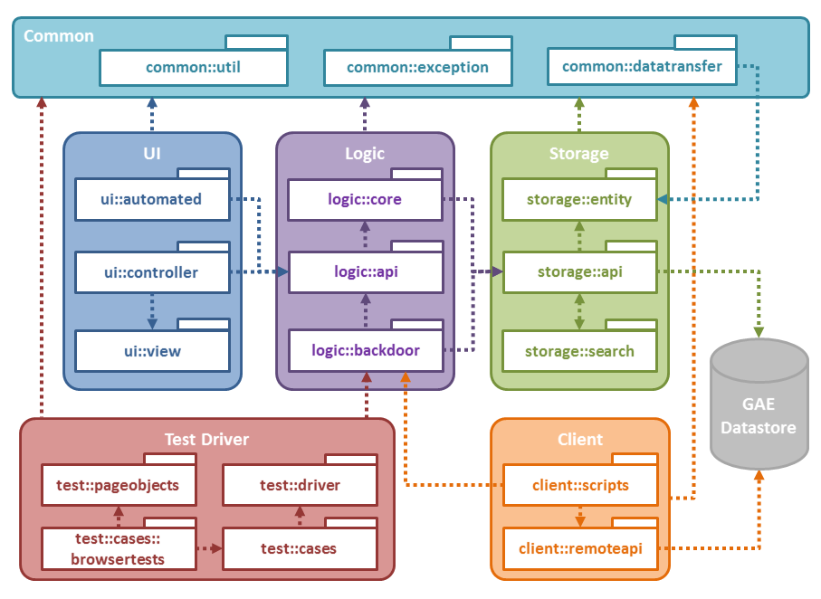
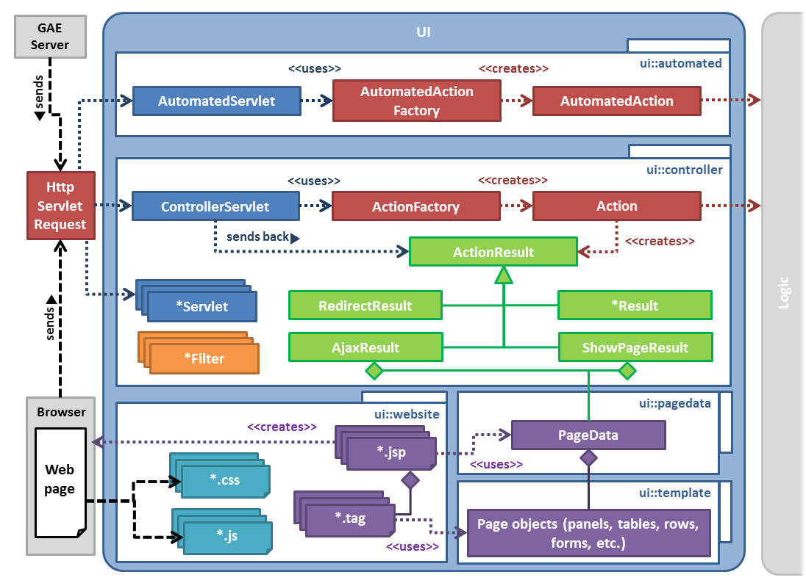
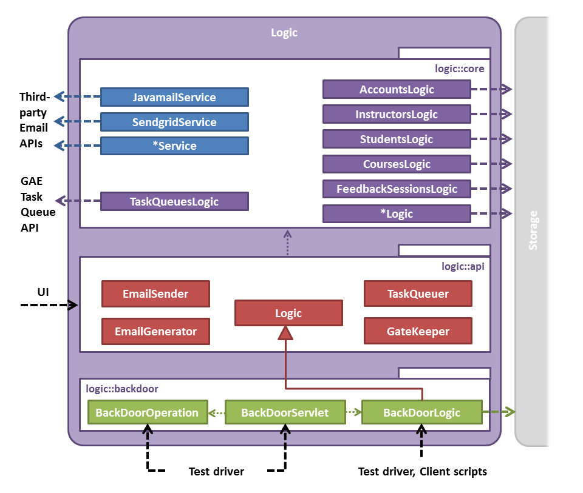
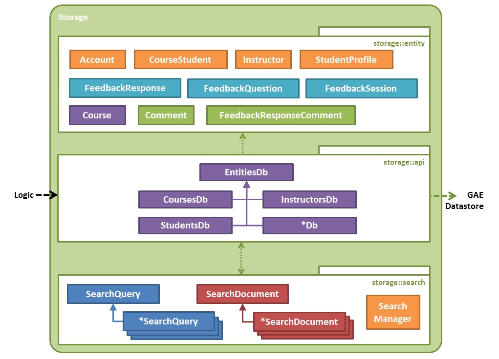
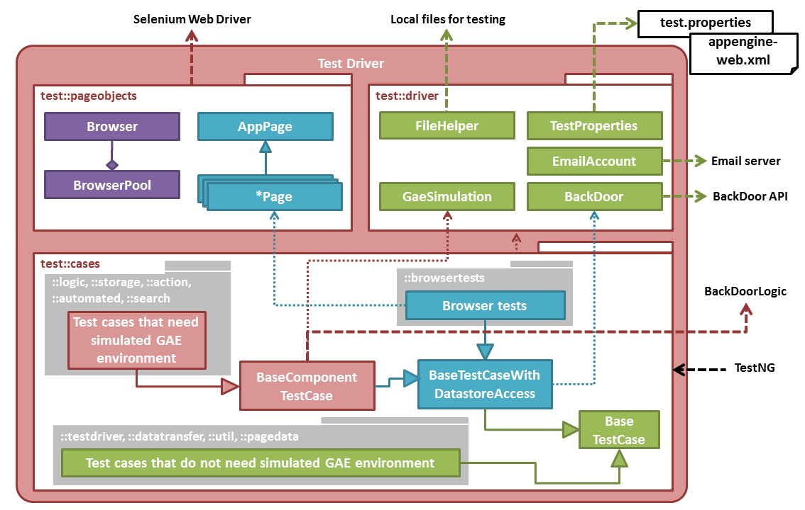
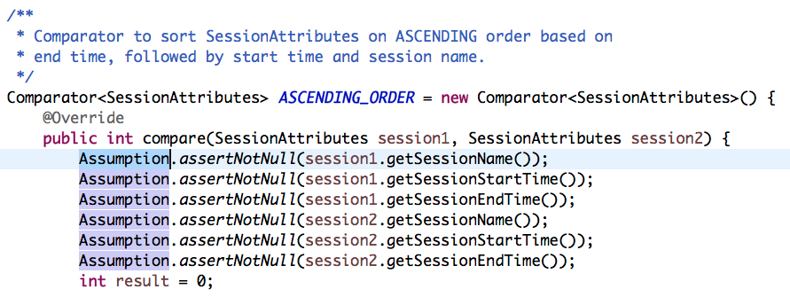
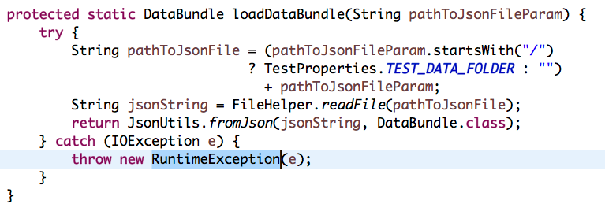

## Technical Report: Static Analysis (Java) in TEAMMATES
### Introduction

Static analysis tools have been widely used in TEAMMATES, which is helpful in maintaining code standard, coding quality or obtain even bug-free code. This report explains how static analysis tools for Java have been used currently in the project. In addition, it also explores some additional static analysis rules, which could be enforced gradually in the project.

#### Existing Static Analysis Rules

Currently, four static analysis tools are used in TEAMMATES for Java. All of them are integrated into `Gradle` build task `staticAnalysis` in CI (Continue Integration) process. Details of the four tools are as follows.

##### CheckStyle

`CheckStyle` reports violations based on provided [`XML`](https://github.com/TEAMMATES/teammates/blob/bd97f4210749b8a58a8285258098c2f91d492099/static-analysis/teammates-checkstyle.xml) file. It is used to enforce stylistic standard. For example, we enforce that right curly brackets (`{`) should not be put in a new line.

##### Macker

`Macker` is used to detect violations in high-level design. For example, one of the current enforced rule says that ["test cases should not be dependent on each other"](https://github.com/TEAMMATES/teammates/blob/bd97f4210749b8a58a8285258098c2f91d492099/static-analysis/teammates-macker.xml#L3). Currently, there are only two rules for this analyser.

##### PMD

`PMD` is used to find design problems such as unused imports. [The rule sets](https://github.com/TEAMMATES/teammates/blob/bd97f4210749b8a58a8285258098c2f91d492099/static-analysis/teammates-pmd.xml) of `PMD` are much bigger than those in `CheckStyle`. Some rules in `PMD` only make sense for production code. Therefore, we have [another `PMD` configuration](https://github.com/TEAMMATES/teammates/blob/bd97f4210749b8a58a8285258098c2f91d492099/static-analysis/teammates-pmdMain.xml) for `main` code.

##### FindBugs

Only one [rule(`FindDeadLocalStores`)](https://github.com/TEAMMATES/teammates/blob/bd97f4210749b8a58a8285258098c2f91d492099/build.gradle#L326) is enforced in `Findbugs` currently. `Findbugs` cannot print violations in the build log. It is almost excluded in the CI process because we cannot check which rules are violated in the console when build fails.

*Links updated at commit [bd97f42](https://github.com/TEAMMATES/teammates/commit/bd97f4210749b8a58a8285258098c2f91d492099) at master* 

### Additional Static Analysis Rules

Beside existing rules, static analysis in Java for TEAMMATES can be explored further. We shall discuss some additional rules in `CheckStyle`, `Macker`, `PMD` and `Findbugs`. Concrete configurations or customised checkers will be proposed.

We shall divide the discussion by content into three sections: [**Coding Standard**](#coding-standard), [**Design Principle**](#design-principle) and [**Bug Prevention**](#bug-prevention). 

#### Coding Standard

We use coding standard in [OSS Generic](https://oss-generic.github.io/process/codingStandards/CodingStandard-Java.html) project for TEAMMATES. Most of the standards have been enforced using `CheckStyle` or `PMD`. Several of them can be explored further.

##### Boolean Variable Naming Convention

According to [the coding standard](https://oss-generic.github.io/process/codingStandards/CodingStandard-Java.html), ["boolean variables should be prefixed with ‘is’"](https://oss-generic.github.io/process/codingStandards/CodingStandard-Java.html#specific-naming-conventions). There are a few alternatives, which are "has", "can" and "should". Besides, it requires us to avoid boolean variables that represent the negation of a thing (`isNotInitialized` is better than `isInitialized `).

Currently, all the static analysis tools don't support check of this naming convention. We shall write our own check.

`CheckStyle` provides us [a way to write customised check](http://checkstyle.sourceforge.net/writingchecks.html). Basically, [the check](https://github.com/xpdavid/teammates/blob/checkstyle-boolean-variable/static-analysis/checkstyle-lib/src/java/BooleanNameCheck.java) will check name of each boolean variable against the naming convention.

``` java
// part of the code (Core Logic)

for (String allowedPrefix : allowedPrefixes) {
    if (variableName.startsWith(allowedPrefix)) {
        if (isNameNegationOfThing(variableName, allowedPrefix)) {
            log(ast.getLineNo(), ast.getColumnNo(),
                    String.format(MSG_NEGATION, variableName), ast.getText()); // violation caught
        }
        return;
    }
}

log(ast.getLineNo(), ast.getColumnNo(),
        String.format(MSG_NAMING, Arrays.toString(allowedPrefixes)), ast.getText()); // violation caught
```

Run the check against TEAMMATES ([bd97f42](https://github.com/TEAMMATES/teammates/commit/bd97f4210749b8a58a8285258098c2f91d492099 at `master`)) and we will get violation reports for `checkstyleMain` and `checkstyleTest`

- [CheckstyleMain](http://htmlpreview.github.io/?https://github.com/xpdavid/CS2103R-Report/blob/master/codingStandard/booleanNaming/main.html)
- [CheckstyleTest](http://htmlpreview.github.io/?https://github.com/xpdavid/CS2103R-Report/blob/master/codingStandard/booleanNaming/test.html)

For production code, there are 122 violations. Some violations such as `participantIsGeneral` are valid. `isParticipantGeneral` is more appropriate in this case. Some of the violations may be reasonable as the names may start with `allow` instead of `is, has, can, should`. Some boolean variables represent the negation of thing such as `isNotTeammatesLog`, but there are some false positives. For example, `isNotSureAllowed` and `isNotificationIconShown` should not be included.

##### Variable Declaration Usage Distance

In the coding standard, it says that ["variables should be initialised where they are declared and they should be declared in the smallest scope possible"](https://oss-generic.github.io/process/codingStandards/CodingStandard-Java.html#general-naming-conventions). There exists a rule in `CheckStyle` for this coding standard: `VariableDeclarationUsageDistance`, which just checks the distance between declaration of variables and their first usages.

The default distance of this check is `3`. Here is the graph of number of violations VS `distance`. (*Based on [8f873](https://github.com/TEAMMATES/teammates/tree/8f87384b01cbe910d805d33bd19f77636c85d06d) at master*)


Individual reports:

- `checkstyleMain`: [Max Distance 3](http://htmlpreview.github.io/?https://github.com/xpdavid/CS2103R-Report/blob/master/codingStandard/variableDistance/checkstyle_3/main.html), [Max Distance 4](http://htmlpreview.github.io/?https://github.com/xpdavid/CS2103R-Report/blob/master/codingStandard/variableDistance/checkstyle_4/main.html), [Max Distance 5](http://htmlpreview.github.io/?https://github.com/xpdavid/CS2103R-Report/blob/master/codingStandard/variableDistance/checkstyle_5/main.html), [Max Distance 6](http://htmlpreview.github.io/?https://github.com/xpdavid/CS2103R-Report/blob/master/codingStandard/variableDistance/checkstyle_6/main.html), [Max Distance 7](http://htmlpreview.github.io/?https://github.com/xpdavid/CS2103R-Report/blob/master/codingStandard/variableDistance/checkstyle_7/main.html), [Max Distance 8](http://htmlpreview.github.io/?https://github.com/xpdavid/CS2103R-Report/blob/master/codingStandard/variableDistance/checkstyle_8/main.html), [Max Distance 9](http://htmlpreview.github.io/?https://github.com/xpdavid/CS2103R-Report/blob/master/codingStandard/variableDistance/checkstyle_9/main.html), [Max Distance 10](http://htmlpreview.github.io/?https://github.com/xpdavid/CS2103R-Report/blob/master/codingStandard/variableDistance/checkstyle_10/main.html)
- `checkstyleTest`:
[Max Distance 3](http://htmlpreview.github.io/?https://github.com/xpdavid/CS2103R-Report/blob/master/codingStandard/variableDistance/checkstyle_3/test.html), [Max Distance 4](http://htmlpreview.github.io/?https://github.com/xpdavid/CS2103R-Report/blob/master/codingStandard/variableDistance/checkstyle_4/test.html), [Max Distance 5](http://htmlpreview.github.io/?https://github.com/xpdavid/CS2103R-Report/blob/master/codingStandard/variableDistance/checkstyle_5/test.html), [Max Distance 6](http://htmlpreview.github.io/?https://github.com/xpdavid/CS2103R-Report/blob/master/codingStandard/variableDistance/checkstyle_6/test.html), [Max Distance 7](http://htmlpreview.github.io/?https://github.com/xpdavid/CS2103R-Report/blob/master/codingStandard/variableDistance/checkstyle_7/test.html), [Max Distance 8](http://htmlpreview.github.io/?https://github.com/xpdavid/CS2103R-Report/blob/master/codingStandard/variableDistance/checkstyle_8/test.html), [Max Distance 9](http://htmlpreview.github.io/?https://github.com/xpdavid/CS2103R-Report/blob/master/codingStandard/variableDistance/checkstyle_9/test.html), [Max Distance 10](http://htmlpreview.github.io/?https://github.com/xpdavid/CS2103R-Report/blob/master/codingStandard/variableDistance/checkstyle_10/test.html)

There are false positives, especially in test code. For example, we may prefer this way, where we define all the variables first.

``` java
Instructor ins1inC1S1 = new ...
Instructor ins2inC1S1 = new ...
Instructor ins3inC2S1 = new ...
Instructor ins1inC4S1 = new ...
Instructor ins1inC5S1 = new ...

// ... test case goes here
```

However, there are some valid violations. For example, in production code, it is not a good practice to initialise a variable as `null` and assign value later (`pointsForEachRecipientString` in this case). 


##### Comments Indentation

According to the coding standard, [comments should be indented relative to their position in the code](https://oss-generic.github.io/process/codingStandards/CodingStandard-Java.html#comments). There is a rule in `CheckStyle`: `CommentsIndentation`, enforces the same amount of indentation for comments and surrounding code.

The rule is enforced in [#6814](https://github.com/TEAMMATES/teammates/pull/6814).

Sample violation:


##### Spelling of Words

The most boring thing for reviewers is finding typos in PR (Pull Request). The reviewer may need to spend unnecessary time finding typos. Also, the submitter gets disappointed. Here is the solution. If we strictly follow the camel case naming convention and use underscore to separate words in constants. We can leave this work to computer bots.

The idea is that we extract words from variable names or method names and check whether it exists in any English dictionary.

There exists [a comprehensive English dictionary](https://github.com/dwyl/english-words), which includes around 34 thousands English words. In addition, we could define our own vocabulary such as `html`, `css` and `tooltips`.

Customised `CheckStyle` check:

``` java
@Override
public void visitToken(DetailAST ast) {
    String name = getName(ast);

    String[] wordsWithoutUnderscore = name.split("_");
    for (String segment : wordsWithoutUnderscore) {
        String[] words = segment.split(CAMEL_CASE_SPLITER_REGEX);
        for(String word : words) {
            if (!isNameValid(word.toLowerCase())) {
                log(ast.getLineNo(), ast.getColumnNo(), // violation caught
                        String.format(MSG, word), ast.getText());
            }
        }
    }
}
```

Here are two dictionaries used in the checks

- [English words](https://github.com/xpdavid/teammates/blob/checkstyle-boolean-variable/static-analysis/checkstyle-lib/dict.txt)
- [Words defined by TEAMMATES](https://github.com/xpdavid/teammates/blob/checkstyle-boolean-variable/static-analysis/checkstyle-lib/teammates-dict.txt)

When running the check against master (at [8f8738](https://github.com/TEAMMATES/teammates/tree/8f87384b01cbe910d805d33bd19f77636c85d06d)), we get [658 violations for production code](http://htmlpreview.github.io/?https://github.com/xpdavid/CS2103R-Report/blob/master/codingStandard/spelling/main.html). There are some false positives. However, there are many valid cases. 


In addition, we also found frequent occurrence of `name1`, `name2`, `student1` etc. For test code, these should be acceptable. However, for production code, naming in this way would result in confusion.


[`CheckStyle` report for test code](http://htmlpreview.github.io/?https://github.com/xpdavid/CS2103R-Report/blob/master/codingStandard/spelling/test.html) gets 532 violations. Note that a new file ([Regex Name](https://github.com/xpdavid/teammates/blob/checkstyle-boolean-variable/static-analysis/checkstyle-lib/teammates-dict-regex.txt)) should be added as we now allow naming like `name1`, `session1` etc in test code.

Some of them are false positive. However, there are valid cases.


Furthermore, we can also see the violation of naming convention. 


In this case, `instructor1ofCourse1` should be `instructor1OfCourse1` (although it is arguable whether to capitalised the `o` or not).


#### Design Principle

##### API Design

One of the principles in designing API is hiding of the internal implementation to user. In other words, we should avoid using implementation types and use the interface instead. There is a `PMD` rule for this: `LooseCoupling`. This rule can be applied to TEAMMATES production code.

We could run the check for TEAMMATES production code and get [the violation report](http://htmlpreview.github.io/?https://github.com/xpdavid/CS2103R-Report/blob/master/designPrinciple/apiDesign/main.html).

One of them is shown as below (From `Logic.java`).


It would be a good practice to change `HashMap<String, CourseSummaryBundle>` to `Map<String, CourseSummaryBundle>` as this method is an API method.

##### Abstraction Level

According to the [design](https://github.com/TEAMMATES/teammates/blob/master/docs/design.md#architecture) documentation of TEAMMATES, there are several abstractions, which define how components should interact with one another. Some components may have dependency to each other while other should not touch each other. Currently, we use `Macker` to check dependency and only two rules are forced. Apparently, there should be more rules.

``` xml
<ruleset name="Test cases should not be dependent on each other" />
<ruleset name="Only UI tests can access page object classes" />
``` 

`CheckStyle` has one rule called `ImportControl` (as its name suggests, we can make certain constraints for the import of certain class). However, it turns out that it is not as powerful as `Macker`. The following discussion will propose new rules for `Macker`. 

We will examine the design one by one.



- UI should not touch Storage
- Logic should not touch UI
- Storage should not touch Logic
- Storage should not touch UI
- Common should not have dependencies to any packages except storage::entity

- Client scripts should be self-contained
- Client should not touch UI
- client::remoteapi should not depend on client::scripts
- client::util should not have dependencies to anything within the client package




- Only *Action can touch Logic API
- Templates are only used in Pagedata
- Pagedata is only used in Controller
- Controller should be self-contained
- Automated actions should be self-contained
- Automated actions should not have dependencies to anything within the UI component



- Logic classes can only access storage::api
- Each logic can only access its corresponding DB (e.g. AccountsLogic -> AccountsDb)
- LogicComponent: BackDoorServlet should not access logic::core/logic::api
- logic::core should not access logic::api
- logic::api/logic::core should not access logic::backdoor




- storage::search should not touch storage::entity
- storage::entity should not depend on anything within the storage component



- Test cases should not be dependent on each other
- Only UI tests can access page object classes
- Only certain test cases can test storage:entity
- Only certain test cases can access GaeSimulation/BackDoorLogic
- BackDoor test driver is only for browser test

**Architectural rules for external API calls**

- Java Logging API can only be accessed via Logger
- Search API can only be accessed via storage::api and storage::search
- Java Persistence API can only be applied to storage::entity
- Google Cloud Storage API can only be accessed via GoogleCloudStorageHelper
- Task Queue API can only be accessed via TaskQueuesLogic
- Remote API can only be accessed via RemoteApiClient
- JDO API can only be accessed via storage::api and client scripts
- Servlet API can only be accessed via Servlet classes, GaeSimulation, and selected utility classes

The rule in `Macker` `xml` format can be found [here](https://github.com/xpdavid/teammates/blob/7086-additional-macker/static-analysis/teammates-macker.xml).

#### Bug Prevention

##### `Findbugs` Enforcement

Findbugs is a powerful static analysis tool as it can examine binary code rather than source code of Java. Therefore, it can find more "bugs" than `PMD` and `CheckStyle`.

Findbugs doesn't support printing violations in console and hence it has been excluded from TEAMMATES. There are only two options for error reporting: `html` and `xml`. [The `html` report of `FindBugs`](http://htmlpreview.github.io/?https://github.com/xpdavid/CS2103R-Report/blob/master/bugPrevention/findbugs/main.html) has 151 violations and some of them are valid.

This is what it looks like when run `./gradlew findbugsMain`

```
:compileJava UP-TO-DATE
:processResources UP-TO-DATE
:classes UP-TO-DATE
:findbugsMain FAILED

FAILURE: Build failed with an exception.

* What went wrong:
Execution failed for task ':findbugsMain'.
> FindBugs rule violations were found. See the report at: file:///Users/XP/Documents/teammates-git/build/reports/findbugs/main.html

* Try:
Run with --stacktrace option to get the stack trace. Run with --info or --debug option to get more log output.

BUILD FAILED

Total time: 1 mins 2.361 secs
```

Printing violations in console is essential for a CI managed project. One possible solution for this is to make `findbugs` generate `xml` report and write [a separate task](https://github.com/xpdavid/teammates/blob/findbugs/build.gradle#L348) in `Gradle` to print the report in console.

```
task printFindbugsMainResults << {
    printFindbugsXml findbugsMain.reports.xml.destination
}

findbugsMain.finalizedBy printFindbugsMainResults
```

Below is the violation report printed by the task `printFindbugsMainResults`.

```
$ ./gradlew findbugsMain
:compileJava UP-TO-DATE
:processResources UP-TO-DATE
:classes UP-TO-DATE
:findbugsMain UP-TO-DATE
:printFindbugsMainResults

[FINDBUGS]
1. [EQ_COMPARETO_USE_OBJECT_EQUALS] {BAD_PRACTICE} see more at http://findbugs.sourceforge.net/bugDescriptions.html#EQ_COMPARETO_USE_OBJECT_EQUALS
	 Class CommentAttributes.java at teammates.common.datatransfer.attributes.CommentAttributes[27:331]
	 Method compareTo at CommentAttributes.java[320:323]

2. [EQ_COMPARETO_USE_OBJECT_EQUALS] {BAD_PRACTICE} see more at http://findbugs.sourceforge.net/bugDescriptions.html#EQ_COMPARETO_USE_OBJECT_EQUALS
	 Class CourseAttributes.java at teammates.common.datatransfer.attributes.CourseAttributes[18:151]
	 Method compareTo at CourseAttributes.java[134:137]

...

* teammates.common.datatransfer - Total Bugs: 0
* teammates.common.datatransfer.attributes - Total Bugs: 2 Priority2: 2
* teammates.common.datatransfer.questions - Total Bugs: 0
* teammates.common.exception - Total Bugs: 0
* teammates.common.util - Total Bugs: 4 Priority1: 3 Priority2: 1
* teammates.logic.api - Total Bugs: 0
* teammates.logic.backdoor - Total Bugs: 0
* teammates.logic.core - Total Bugs: 1 Priority2: 1
* teammates.storage.api - Total Bugs: 0
* teammates.storage.entity - Total Bugs: 0
* teammates.storage.search - Total Bugs: 1 Priority2: 1
* teammates.ui.automated - Total Bugs: 0
* teammates.ui.controller - Total Bugs: 19 Priority2: 19
* teammates.ui.datatransfer - Total Bugs: 0
* teammates.ui.pagedata - Total Bugs: 4 Priority2: 4
* teammates.ui.template - Total Bugs: 1 Priority2: 1

Summary: Total 32 Bugs
```

Through this, we can integrate `findbugs` static analysis tools into TEAMMATES. The developer can run it locally and the CI can run it automatically.

Note that we use [`filter`](https://github.com/xpdavid/teammates/blob/findbugs/static-analysis/teammates-findbugs-filter.xml) to suppress some bugs in `FindBugs`. More filters should be added if we confirm they are not bugs.

##### Usage of `Assumption.java`

Currently, there exists inconsistency in using of `Assumption` and `RuntimeException` in production code in TEAMMATES.

`Assumption`:


`RuntimeException`:


In either way, if the condition fails, the application will be stopped and an error email will be sent to admin.

There is a rule in `PMD` named `AvoidThrowingRawExceptionTypes` and it indicates that throwing raw exception types is not a practice in software engineering. We may want to use `Assumption.assert*` rather than throwing raw exceptions in the production code. Therefore, we should change all `RuntimeException` to make use of `Assumption` class for production code.

When applying the `PMD` rule `AvoidThrowingRawExceptionTypes`, [the report](http://htmlpreview.github.io/?https://github.com/xpdavid/CS2103R-Report/blob/master/bugPrevention/assumption/main.html) indicated there are 11 violations for production code. Some of them even have `// TODO` tags to ask the programmers to replace the `RuntimeException` with `Assumption.assert*`.

For test code, we could be more tolerant as we might use `RuntimeException` to indicate errors.



It is possible to replace the `RuntimeException` with `fail()` method. There are only 14 violations for test code by [`PMD` report](http://htmlpreview.github.io/?https://github.com/xpdavid/CS2103R-Report/blob/master/bugPrevention/assumption/test.html).

### Analysis

#### Existing Static Analysis Rule

Through my observation in TEAMMATES's PR process, the existing static analysis rules work well and detect most of potential issues in PRs effectively. Most of time, there is no need for reviewers to point out stylistic issue. Therefore, we could keep the existing static analysis rule.

#### Additional Static Analysis Rule

When dealing with new rules, we must be very careful as the side effects of some of the new rules may be outweigh their benefits. Through the above discussion, we can see that some rules are worth enforcing, while others are not in consideration to the amount of effort needed to enforce them. We will looks at them individually. 

##### Coding Standard

- It is **not** worth to enforce the rule for boolean variable naming convention. The intention of the coding standard is to make code more readable. However, the customised check just simply checks whether the boolean variables start with certain prefixes. There are many case that a boolean variable doesn't start with `is` but makes sense. However, we can keep the checks and run it frequently to check possible violations.

- It is **not** worth to enforce the variable declaration usage distance rule. We could find some valid cases to violate this rule. For example, we may want to get all parameters in a controller at first rather than getting them when using them. This practice helps developers know which parameters the controller will use. Besides, for test code, as we have discussed in the previous section, we may want to declare all test data at the beginning. However, this checks could be used to detect violations such as initialising variable to `null`.

- The `Comments Indentation` rule is already forced in current production code.

- It is **not** worth to enforce the spelling of words rule in TEAMMATES. The reason is obviously as the maintenance would be a nightmare. We invent new words everyday, aren't we? However, this check could be run frequently to check whether there are typos or not.

##### Design Principle

- It is **worth**  enforcing the `PMD` rule `LooseCoupling`, which could make our APIs more flexible and "avoid using implementation types and use the interface instead" is one of rule in API design.

- It is **worth** enforcing the new rule added to `Macker` to check any design flaws. It will prevent us from breaking the design accidentally.

##### Bug Prevention

- It is **worth** enforcing the `Findbugs` plugins in our build process **with** suppression. FindBug may find "bugs" that `CheckStyle` and `PMD` could not find. We now also have the ability to print violations in console.

- It is **wroth** enforcing the `AvoidThrowingRawExceptionTypes` rule to give a good software engineering practice. We could be consistent that we use `Assumption` to detect bugs and use `Exception` to deal with exceptions.

### Conclusion

In conclusion, we should keep the existing static analysis rules and it is worth enforcing most of the additional rules that are discussed above for TEAMMATES. In addition, the not worthy ones could also be an option to find potential stylistic flaws, but we need to put efforts to maintain them.

We are almost done with static analysis tools for Java (at least with `CheckStyle`, `Findbugs`, `Macker` and `PMD`), further exploration could be done to make this process more automatic. For example, we can have PR-bot to comment violations. Also, for the spelling rule I have introduced or the boolean variable naming, the PR-bot could make comment in the PR but not necessarily to fail the build.