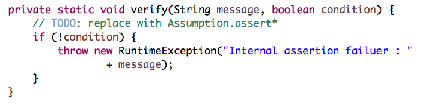

## Additional Static Analysis Rules for TEAMMATES (Java)

### Introduction

Static analysis tools have been widely used in TEAMMATES, which help us a lot in maintaining coding standard, coding quality or even bug-free code. This report will explore more static analysis rules for Java and analysis the practicability of these rules.

#### Background

Currently, four static analysis tools are used in TEAMMATES for Java.

Here are the configurations of them.

- [`CheckStyle`](https://github.com/TEAMMATES/teammates/blob/bd97f4210749b8a58a8285258098c2f91d492099/static-analysis/teammates-checkstyle.xml)
- [`Macker`](https://github.com/TEAMMATES/teammates/blob/bd97f4210749b8a58a8285258098c2f91d492099/static-analysis/teammates-macker.xml)
- [`PMD`](https://github.com/TEAMMATES/teammates/blob/bd97f4210749b8a58a8285258098c2f91d492099/static-analysis/teammates-pmd.xml) (As we decide some of rules in PMD will only be enforced in production code, we write [another configuration](https://github.com/TEAMMATES/teammates/blob/bd97f4210749b8a58a8285258098c2f91d492099/static-analysis/teammates-pmdMain.xml) in addition to this)
- [`FindBugs`](https://github.com/TEAMMATES/teammates/blob/bd97f4210749b8a58a8285258098c2f91d492099/build.gradle#L326) (Only one pattern `FindDeadLocalStores` is used)

*Updated at commit [bd97f42](https://github.com/TEAMMATES/teammates/commit/bd97f4210749b8a58a8285258098c2f91d492099) at master* 

In discussion in [#6519](https://github.com/TEAMMATES/teammates/issues/6519), we agree that we use `CheckStyle` for style issues and `PMD` for coding/design issues. The rest of the report will follow the rule also.

`Macker` is used to detect violations in high-level design. For example, one of the current enforced rule says that ["test cases should not be dependent on each other"](https://github.com/TEAMMATES/teammates/blob/bd97f4210749b8a58a8285258098c2f91d492099/static-analysis/teammates-macker.xml#L3). Currently, there are only two rules for this analyser.

`Findbugs` cannot print violations in build log. We cannot check which rules are violated in console when build fails. Therefore, we exclude it and only enforce one rule from it.

### Discussion

This report will discuss possible rules in `CheckStyle`, `Macker`, `PMD` and `Findbugs`. Concrete configurations or customised checkers will be proposed.

We will divide the discussion into three sections: `Coding Standard`, `Design Principle` and `Bug Prevention`. 

#### Coding Standard

We use coding standard in [OSS Generic](https://oss-generic.github.io/process/codingStandards/CodingStandard-Java.html) project for TEAMMATES. Most of the standards have been enforced in `CheckStyle` or `PMD`. Severals of them can be explored more.

##### Boolean Variable Naming Conversion

In the coding standard, it says that ["boolean variables should be prefixed with ‘is’"](https://oss-generic.github.io/process/codingStandards/CodingStandard-Java.html#specific-naming-conventions). There are a few alternatives, which are "has", "can", "should". Also it requires us to avoid boolean variables that represent the negation of a thing (`isNotInitialized` is better than `isInitialized `).

Currently, all the static analysis tools don't support check for this naming conversion. We shall write our own check.

`CheckStyle` provided a way to write customised check. Basically, [the check](https://github.com/xpdavid/teammates/blob/checkstyle-boolean-variable/static-analysis/checkstyle-lib/src/java/BooleanNameCheck.java) will check the naming conversion for each boolean variable.

``` java
// part of the code (Core Logic)

for (String allowedPrefix : allowedPrefixes) {
    if (variableName.startsWith(allowedPrefix)) {
        if (isNameNegationOfThing(variableName, allowedPrefix)) {
            log(ast.getLineNo(), ast.getColumnNo(),
                    String.format(MSG_NEGATION, variableName), ast.getText()); // violation caught
        }
        return;
    }
}

log(ast.getLineNo(), ast.getColumnNo(),
        String.format(MSG_NAMING, Arrays.toString(allowedPrefixes)), ast.getText()); // violation caught
```

When run the check against TEAMMATES ([bd97f42](https://github.com/TEAMMATES/teammates/commit/bd97f4210749b8a58a8285258098c2f91d492099 at `master`)), here are the reports for `checkstyleMain` and `checkstyleTest`

- [CheckstyleMain](http://htmlpreview.github.io/?https://github.com/xpdavid/CS2103R-Report/blob/master/codingStandard/booleanNaming/main.html)
- [CheckstyleTest](http://htmlpreview.github.io/?https://github.com/xpdavid/CS2103R-Report/blob/master/codingStandard/booleanNaming/test.html)

For production code, there are 122 violations. Some violations are valid such as `participantIsGeneral`. `isParticipantGeneral` is more appropriate in this case. Some of the violations may be reasonable as the names may start with `allow` instead of `is, has, can, should`. Some boolean variables try to represent the negation of thing such as `isNotTeammatesLog`, but there are some false positives. For example, `isNotSureAllowed` and `isNotificationIconShown` should not be included.

##### Variable Declaration Usage Distance

In the coding standard, it says that ["variables should be initialised where they are declared and they should be declared in the smallest scope possible"](https://oss-generic.github.io/process/codingStandards/CodingStandard-Java.html#general-naming-conventions). There is a rule existing in `CheckStyle` for this coding standard: `VariableDeclarationUsageDistance`, which just checks the distance between declaration of variables and their first usages.

The default distance of this check is `3`. Here is the graph of number of violations VS `distance`. (*Based on [8f873](https://github.com/TEAMMATES/teammates/tree/8f87384b01cbe910d805d33bd19f77636c85d06d) at master*)


Individual reports:

- `checkstyleMain`: [Max Distance 3](http://htmlpreview.github.io/?https://github.com/xpdavid/CS2103R-Report/blob/master/codingStandard/variableDistance/checkstyle_3/main.html), [Max Distance 4](http://htmlpreview.github.io/?https://github.com/xpdavid/CS2103R-Report/blob/master/codingStandard/variableDistance/checkstyle_4/main.html), [Max Distance 5](http://htmlpreview.github.io/?https://github.com/xpdavid/CS2103R-Report/blob/master/codingStandard/variableDistance/checkstyle_5/main.html), [Max Distance 6](http://htmlpreview.github.io/?https://github.com/xpdavid/CS2103R-Report/blob/master/codingStandard/variableDistance/checkstyle_6/main.html), [Max Distance 7](http://htmlpreview.github.io/?https://github.com/xpdavid/CS2103R-Report/blob/master/codingStandard/variableDistance/checkstyle_7/main.html), [Max Distance 8](http://htmlpreview.github.io/?https://github.com/xpdavid/CS2103R-Report/blob/master/codingStandard/variableDistance/checkstyle_8/main.html), [Max Distance 9](http://htmlpreview.github.io/?https://github.com/xpdavid/CS2103R-Report/blob/master/codingStandard/variableDistance/checkstyle_9/main.html), [Max Distance 10](http://htmlpreview.github.io/?https://github.com/xpdavid/CS2103R-Report/blob/master/codingStandard/variableDistance/checkstyle_10/main.html)
- `checkstyleTest`:
[Max Distance 3](http://htmlpreview.github.io/?https://github.com/xpdavid/CS2103R-Report/blob/master/codingStandard/variableDistance/checkstyle_3/test.html), [Max Distance 4](http://htmlpreview.github.io/?https://github.com/xpdavid/CS2103R-Report/blob/master/codingStandard/variableDistance/checkstyle_4/test.html), [Max Distance 5](http://htmlpreview.github.io/?https://github.com/xpdavid/CS2103R-Report/blob/master/codingStandard/variableDistance/checkstyle_5/test.html), [Max Distance 6](http://htmlpreview.github.io/?https://github.com/xpdavid/CS2103R-Report/blob/master/codingStandard/variableDistance/checkstyle_6/test.html), [Max Distance 7](http://htmlpreview.github.io/?https://github.com/xpdavid/CS2103R-Report/blob/master/codingStandard/variableDistance/checkstyle_7/test.html), [Max Distance 8](http://htmlpreview.github.io/?https://github.com/xpdavid/CS2103R-Report/blob/master/codingStandard/variableDistance/checkstyle_8/test.html), [Max Distance 9](http://htmlpreview.github.io/?https://github.com/xpdavid/CS2103R-Report/blob/master/codingStandard/variableDistance/checkstyle_9/test.html), [Max Distance 10](http://htmlpreview.github.io/?https://github.com/xpdavid/CS2103R-Report/blob/master/codingStandard/variableDistance/checkstyle_10/test.html)

There are false positives, especially in test code. For example, we may prefer this way, where we define all the variables first.

``` java
Instructor ins1inC1S1 = new ...
Instructor ins2inC1S1 = new ...
Instructor ins3inC2S1 = new ...
Instructor ins1inC4S1 = new ...
Instructor ins1inC5S1 = new ...

// ... test case goes here
```

However, there are some valid violations. For example, in production code, it is not a good practice to declare something `null` and assign value later (`pointsForEachRecipientString` in this case). 


##### Comments Indentation

According to the coding standard, [comments should be indented relative to their position in the code](https://oss-generic.github.io/process/codingStandards/CodingStandard-Java.html#comments). There is a rule in `CheckStyle`: `CommentsIndentation`, which controls the indentation between comments and surrounding code.

The rule is enforced in [#6814](https://github.com/TEAMMATES/teammates/pull/6814).

Sample violation:


##### Spelling of Words

The most boring thing for reviewers is to finding typos in PR. The reviewer may need to spend unnecessary time finding typos. Also, the submitter get disappointed. Here is the solution. If we follow strictly the camel case naming conversion and use underscore to separate word in constants. We can leave this work to computer bots.

The idea is that we extract words from variable names or method names and check whether it exists in english dictionary to find typos.

There existing [a comprehensive english dictionary](https://github.com/dwyl/english-words), which included around 34 thousands english words. In addition, we could define our own words such as `html`, `css` and `tooltips`.

Customised `CheckStyle` check:

``` java
@Override
public void visitToken(DetailAST ast) {
    String name = getName(ast);

    String[] wordsWithoutUnderscore = name.split("_");
    for (String segment : wordsWithoutUnderscore) {
        String[] words = segment.split(CAMEL_CASE_SPLITER_REGEX);
        for(String word : words) {
            if (!isNameValid(word.toLowerCase())) {
                log(ast.getLineNo(), ast.getColumnNo(), // violation caught
                        String.format(MSG, word), ast.getText());
            }
        }
    }
}
```

Here are three dictionaries used in the checks

- [English words](https://github.com/xpdavid/teammates/blob/checkstyle-boolean-variable/static-analysis/checkstyle-lib/dict.txt)
- [Words defined by TEAMMATES](https://github.com/xpdavid/teammates/blob/checkstyle-boolean-variable/static-analysis/checkstyle-lib/teammates-dict.txt)

When running the check against master (at [8f8738](https://github.com/TEAMMATES/teammates/tree/8f87384b01cbe910d805d33bd19f77636c85d06d)), we get [658 violations for production code](http://htmlpreview.github.io/?https://github.com/xpdavid/CS2103R-Report/blob/master/codingStandard/spelling/main.html). There are some false positives. However, there are many valid cases. 


In addition, we also found a lot of `name1`, `name2`, `student1` etc. For test code, these should be ok. However, for production code, naming in this way would result in confusion.


[`CheckStyle` report for Test code](http://htmlpreview.github.io/?https://github.com/xpdavid/CS2103R-Report/blob/master/codingStandard/spelling/test.html) gets 532 violations. Note that a new file ([Regex Name](https://github.com/xpdavid/teammates/blob/checkstyle-boolean-variable/static-analysis/checkstyle-lib/teammates-dict-regex.txt)) should be added as we now allow naming like `name1`, `session1` etc in test code.

Some of them is false positive. However, there are valid cases.


Furthermore, we can also see the violation of naming conversion. 


In this case, `instructor1ofCourse1` should be `instructor1OfCourse1` (although it is arguable whether to capitalised the `o` or not).


#### Design Principle

##### API Design

One of the principle in designing API is to hide the internal implementation to user. In other word, we should avoid using implementation types and use the interface instead. There is a `PMD` rule for this: `LooseCoupling`. This rule can be applied to TEAMMATES production code.

We could run the check for TEAMMATES production code and get [the violation report](http://htmlpreview.github.io/?https://github.com/xpdavid/CS2103R-Report/blob/master/designPrinciple/apiDesign/main.html).

One of them is shown as below (From `Logic.java`).


It would be a good practice to change `HashMap<String, CourseSummaryBundle>` to `Map<String, CourseSummaryBundle>` as this method is an API method.

##### Abstraction Level

According to the [design](https://github.com/TEAMMATES/teammates/blob/master/docs/design.md#architecture) documentation of TEAMMATES, there are several abstraction, which defines how components should interact with each other. Some components can have dependency to each other while other should not touch each other. Currently, we use `Macker` to check dependency and only two rule is forced. Apparently, there should be more rules.

``` xml
<ruleset name="Test cases should not be dependent on each other" />
<ruleset name="Only UI tests can access page object classes" />
``` 

`CheckStyle` has one rule called `ImportControl` (as indicated in its name, we can make certain constrain for the import of certain class), however, it turns out that it is not as powerful as `Macker`. The following discussion will propose new rules for `Macker`. 

We will examine the design one by one.


- The UI should not touch Storage directly
- The Logic should not touch UI
- The Storage should not touch Logic
- The Storage should not touch UI
- Client should not touch UI (This diagram need to be updated as Client can touch storage and logic)
- `client::remoteapi` can be only access by `client::scripts`
- `client::util` should only be used inside client (This diagram need to be updated to show `client::util`)


- Only `*Action` in can touch logic (especially `Logic.java` as Facade class)
- `*PageData` is only used in `*Action` and `ActionResult`
- `*Action` can only be created by `*ActionFactory`
- `ActionResult` can only be created by `*Action`


- Each logic can only access its corresponding DB (e.g. AccountsLogic -> AccountsDb)
- BackDoorServlet should only access BackDoorLogic, not `logic:core`


- `storage::entity` should only be accessed by `storage::api` and `common:datatransfer`
- `storage::search` should only be accessed by `storage::api`


- Test cases should not be dependent on each other (already there)
- Only browser tests tests can access page object classes (already there)
- The Test Driver should be only used in test cases
- util and browsertest cannot access GaeSimulation
- action test cases should only interact with back-end through BackDoor API (The rule should be there, but there are too many violations)

The rule in `Macker` `xml` format can be found [here](https://github.com/xpdavid/teammates/blob/additional-macker/static-analysis/teammates-macker.xml).

#### Bug Prevention

##### `Findbugs` Enforcement

Findbugs is a powerful static analysis tool as it can examine binary code rather than source code of Java. Therefore, it can find more "bugs" than `PMD` and `CheckStyle`.

Findbugs doesn't support printing violations in console and this is why it has been excluded from TEAMMATES. There are only two options for error reporting: `html` and `xml`. [The `html` report of `FindBugs`](http://htmlpreview.github.io/?https://github.com/xpdavid/CS2103R-Report/blob/master/bugPrevention/findbugs/main.html) has 151 violations and some of them are valid.

This is what it looks like when run `./gradlew findbugsMain`

```
:compileJava UP-TO-DATE
:processResources UP-TO-DATE
:classes UP-TO-DATE
:findbugsMain FAILED

FAILURE: Build failed with an exception.

* What went wrong:
Execution failed for task ':findbugsMain'.
> FindBugs rule violations were found. See the report at: file:///Users/XP/Documents/teammates-git/build/reports/findbugs/main.html

* Try:
Run with --stacktrace option to get the stack trace. Run with --info or --debug option to get more log output.

BUILD FAILED

Total time: 1 mins 2.361 secs
```

To print violations in console is essential for a CI managed project. One possible solution for this is to make `findbugs` to generate `xml` report and write [a separate task](https://github.com/xpdavid/teammates/blob/findbugs/build.gradle#L348) in `Gradle` to print the report in console.

```
task printFindbugsMainResults << {
    printFindbugsXml findbugsMain.reports.xml.destination
}

findbugsMain.finalizedBy printFindbugsMainResults
```

Below is the violation report print by the task `printFindbugsMainResults`.

```
$ ./gradlew findbugsMain
:compileJava UP-TO-DATE
:processResources UP-TO-DATE
:classes UP-TO-DATE
:findbugsMain UP-TO-DATE
:printFindbugsMainResults

[FINDBUGS]
1. [EQ_COMPARETO_USE_OBJECT_EQUALS] {BAD_PRACTICE} see more at http://findbugs.sourceforge.net/bugDescriptions.html#EQ_COMPARETO_USE_OBJECT_EQUALS
	 Class CommentAttributes.java at teammates.common.datatransfer.attributes.CommentAttributes[27:331]
	 Method compareTo at CommentAttributes.java[320:323]

2. [EQ_COMPARETO_USE_OBJECT_EQUALS] {BAD_PRACTICE} see more at http://findbugs.sourceforge.net/bugDescriptions.html#EQ_COMPARETO_USE_OBJECT_EQUALS
	 Class CourseAttributes.java at teammates.common.datatransfer.attributes.CourseAttributes[18:151]
	 Method compareTo at CourseAttributes.java[134:137]

...

* teammates.common.datatransfer - Total Bugs: 0
* teammates.common.datatransfer.attributes - Total Bugs: 2 Priority2: 2
* teammates.common.datatransfer.questions - Total Bugs: 0
* teammates.common.exception - Total Bugs: 0
* teammates.common.util - Total Bugs: 4 Priority1: 3 Priority2: 1
* teammates.logic.api - Total Bugs: 0
* teammates.logic.backdoor - Total Bugs: 0
* teammates.logic.core - Total Bugs: 1 Priority2: 1
* teammates.storage.api - Total Bugs: 0
* teammates.storage.entity - Total Bugs: 0
* teammates.storage.search - Total Bugs: 1 Priority2: 1
* teammates.ui.automated - Total Bugs: 0
* teammates.ui.controller - Total Bugs: 19 Priority2: 19
* teammates.ui.datatransfer - Total Bugs: 0
* teammates.ui.pagedata - Total Bugs: 4 Priority2: 4
* teammates.ui.template - Total Bugs: 1 Priority2: 1

Summary: Total 32 Bugs
```

Through this, we can integrate `findbugs` static analysis tools into TEAMMATES. The developer can run it locally and the CI can run it automatically.

Note that we use [`filter`](https://github.com/xpdavid/teammates/blob/findbugs/static-analysis/teammates-findbugs-filter.xml) to suppress some bugs in `FindBugs`. More filters should be added if we confirm they are not bugs.

##### Usage of `Assumption.java`

Currently, there exists inconsistency in using of `Assumption` and `RuntimeException` in production code in TEAMMATES.

`Assumption`:


`RuntimeException`:


In both way, if the condition fails, the application will be stopped and an error email will be sent to admin.

There is a rule in `PMD` called `AvoidThrowingRawExceptionTypes` and it indicates that throwing raw exception types is not a practice in software engineering. In addition, we may want to make clear that we use assertions to check something that should never happen, while we use exceptions to check something that might happen. `RuntimeException` is used here only to indicated that something should never happen occurs and thus there is a bug. Therefore, we shall change all `RuntimeException` to make use of `Assumption` class.

When apply the `PMD` rule `AvoidThrowingRawExceptionTypes`, [the report](http://htmlpreview.github.io/?https://github.com/xpdavid/CS2103R-Report/blob/master/bugPrevention/assumption/main.html) indicated there are 11 violations for production code. Some of them even have `// TODO` tags to ask the programmers to replace the `RuntimeException` with `Assumption.assert*`.

For test code, we could be more forgivable as we might use `RuntimeException` to indicate error.


It is possible to replace the `RuntimeException` with `fail()` method. There are only 14 violation for test code by [`PMD` report](http://htmlpreview.github.io/?https://github.com/xpdavid/CS2103R-Report/blob/master/bugPrevention/assumption/test.html).

### Analysis

Through the above discussion, we can see that some rules are worth to enforce, while some rules require a lot of efforts to enforce them. We will looks at them individually. 

#### Coding Standard

- It is **not** worth to force the rule for boolean variable naming conversion. The intention of the coding standard is to make code more readable. But the rule just simply check whether the boolean variables start with certain prefixes. There are many case that a boolean variable doesn't start with `is` but makes sense. However, we can keep the checks and run it frequently to check possible violation.

- It **worth** forcing the variable declaration usage distance rule for **production** code. By doing this, the code would become more readable as the developers don't need to remember declared variables. However, we should exclude this rule for test cases as sometimes we want to declare all test data first.

- The comments Indentation rule is already forced in current production code.

- It is **not** worth to force the spelling of words rule in TEAMMATES. The reason is obviously as the maintenance would be a nightmare. We invent new word everyday, isn't it? However, this check could be run frequently to check whether there are typos or not.

#### Design Principle

- It **worth**  enforcing the `PMD` rule `LooseCoupling`, which could make our API more flexible and I believe "avoid using implementation types and use the interface instead" is one of rule in API design.

- It **worth** enforcing the new rule added to `Macker` to check any design flaws. It will help us to prevent from breaking the design accidentally.

##### Bug Prevention

- It **worth** enforcing the `Findbugs` plugins in our build process **with** suppression. FindBug is more powerful than `CheckStyle` and `PMD`. We now also have the ability to print violations in console.

- It **wroth** enforcing the `AvoidThrowingRawExceptionTypes` rule to give good software engineering practice. We could be consistent that we use `Assumption` to detect bugs and use `Exception` to deal with exceptions.

### Conclusion

In conclusion, it worth enforcing most of the rule that are dicussed above for TEAMMATES. In addition, the not-worth ones can also be an option to find potential stylistic flaws, but we need put efforts to maintain them.

We are almost done with static analysis tools for Java (at least with `CheckStyle`, `Findbugs`, `Macker` and `PMD`), further exploration could be to make this process more automatic. For example, we can have PR-bot to comment violations. Also, for the spelling rule I have introduce or the boolean variable naming, the PR-bot could make comment it the PR but not necessary to make the build fail.